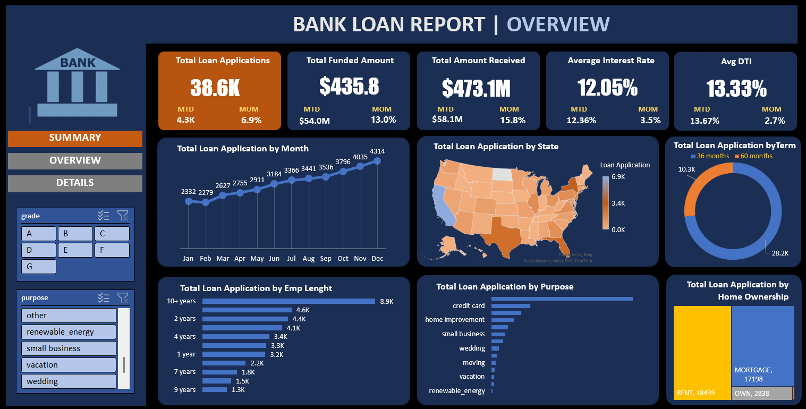
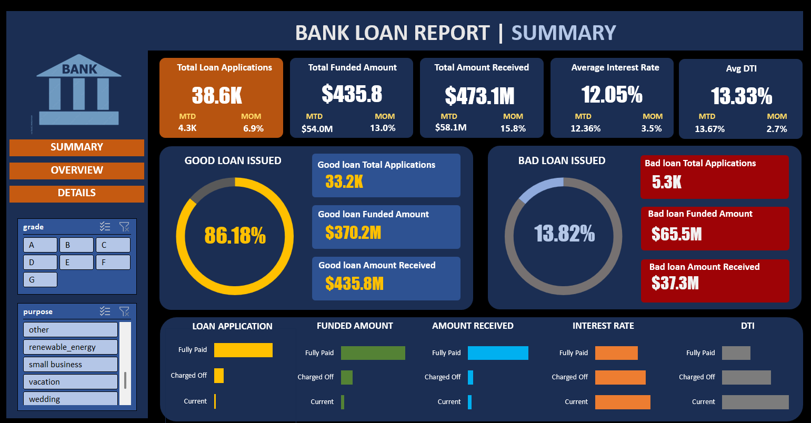

# Bank Loan Analysis Project

## 📌 Overview
This project analyzes **bank loan applications** using **Excel and SQL**. It aims to help financial institutions assess **loan approvals, defaults, interest rates, and borrower profiles** by leveraging structured data analysis. The project involves:

- **Data Cleaning & Processing**: Handling missing values, standardizing data formats, and creating a processed dataset.
- **SQL Query Analysis**: Extracting meaningful insights using optimized SQL queries.
- **Loan Risk Assessment**: Identifying **good vs. bad loans** and understanding borrower risk factors.
- **Excel Dashboard Visualization**: Utilizing **Pivot Tables & Charts** to display key financial metrics.
- **Business Insights**: Providing a structured approach to evaluate **default rates, loan terms, and borrower behavior**.

By integrating SQL-based analytics with Excel-based dashboards, this project delivers a comprehensive **financial decision-making tool** that can be used by banks to monitor lending performance and mitigate risks.

---

## 📊 Dashboard Screenshots
### **Overview Dashboard**


### **Summary Dashboard**


---

## 📂 Dataset
- **Raw Data:** `Raw_Data.csv` (Unprocessed loan data)
- **Processed Data:** `Financial_Loan.xlsx` (Cleaned & structured dataset for analysis)
- **Domain Knowledge:** `Domain_Knowledge.docx`
- **Terminologies:** `Terminologies_in_Data.docx`
- **SQL Queries:** `Bank_Loan_Analysis.sql`
- **Project Report:** `Bank_Loan_Query_Report.docx`

---

## 🔍 Key Features
✅ **Data Cleaning & Processing:**
   - Handled missing values & removed duplicates.
   - Standardized data formats (dates, categorical variables).
   - Created a processed dataset (`Financial_Loan.xlsx`).
✅ **SQL Query Analysis:** Extracted insights using optimized SQL queries.
✅ **Loan Risk Assessment:** Identified **good vs. bad loans** and borrower risk.
✅ **Excel Dashboard:**
   - Created **Pivot Tables & Charts** for interactive analysis.
   - Built trend analysis & loan distribution reports.
✅ **Business Insights:** Helped banks understand **default rates, loan terms, and customer behavior**.

---

## 🛠 Tech Stack
- **Excel** – Data processing, pivot tables, and dashboard visualization
- **SQL (SQL Server Management Studio)** – Data extraction, transformation, and analysis

---

## 📌 SQL Queries Used
```sql
-- Total Loan Applications
SELECT COUNT(id) AS Total_Applications FROM bank_loan_data;

-- Monthly Loan Applications Trend
SELECT MONTH(issue_date) AS Loan_Month, COUNT(id) AS Total_Applications 
FROM bank_loan_data GROUP BY Loan_Month ORDER BY Loan_Month;

-- Loan Default Rate Calculation
SELECT (COUNT(CASE WHEN loan_status = 'Charged Off' THEN id END) * 100.0) / COUNT(id) AS Default_Rate 
FROM bank_loan_data;

-- Average Debt-to-Income Ratio
SELECT AVG(dti) AS Avg_DTI FROM bank_loan_data;

-- Loan Distribution by Purpose
SELECT purpose, COUNT(id) AS Loan_Count FROM bank_loan_data GROUP BY purpose ORDER BY Loan_Count DESC;

-- Loan Amount Distribution by State
SELECT address_state, SUM(loan_amount) AS Total_Loan_Amount FROM bank_loan_data GROUP BY address_state;

-- Interest Rate Analysis
SELECT grade, AVG(int_rate) AS Avg_Interest_Rate FROM bank_loan_data GROUP BY grade ORDER BY Avg_Interest_Rate DESC;
```

---

## 🚀 How to Run the Project
1️⃣ Load the dataset (`Raw_Data.csv` & `Financial_Loan.xlsx`) in **Excel**.
2️⃣ Run `Bank_Loan_Analysis.sql` in **SQL Server Management Studio (SSMS)**.
3️⃣ Explore insights using **Excel dashboards**.


